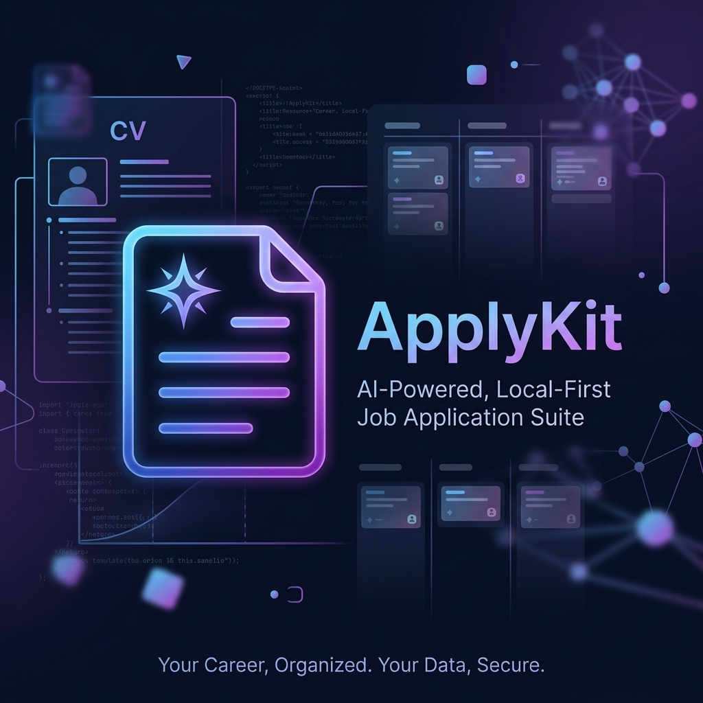

# ApplyKit



[](LICENSE)
[](https://python.org)
[](https://kit.svelte.dev)

**Self-hosted, local-first CV and cover letter generator powered by AI.**
Your data stays on your machine — no cloud, no account, no subscription.

> ⚠️ **Self-hosted only.** ApplyKit is designed to run locally or on your own server. It has no authentication — do not expose it to the public internet without adding your own auth layer.

---

## Features

- **Multi-profile support** — create separate profiles for different roles (e.g. "Software Engineer", "Product Manager"), each with its own history and color
- **AI CV generation** — rewrites bullet points and summary to be ATS-optimized for a specific job description
- **AI cover letter generation** — writes a tailored cover letter from your profile + job description in seconds
- **CV import** — paste or upload an existing PDF/DOCX and AI extracts your profile automatically
- **Job URL scraper** — paste a job posting URL and AI extracts the description
- **Fit analysis** — see how well your profile matches a job description with match score, strengths, gaps, and red flags
- **Smart Apply** — paste a URL, auto-parse job details, and generate a tailored CV + cover letter in one flow
- **Job application tracker** — Kanban board for tracking applications through Applied → Interviewing → Offer → Rejected
- **History** — every generated CV and cover letter is saved, browsable, and filterable by profile
- **PDF export** — download as PDF or use browser print (A4 format)
- **LLM-agnostic** — works with Gemini, OpenAI, Anthropic, or any local model via Ollama
- **Works without an API key** — CV generation falls back to your raw profile data if no LLM is configured
- **Dark mode** — full dark theme support

---

## How It Works

```
Browser (localhost:5173)
       │
       ▼
  SvelteKit Frontend
  - Profile editor (multi-profile)
  - CV preview & export
  - Cover letter editor
  - Fit analysis
  - Job tracker (Kanban)
  - History browser
       │  HTTP (REST API)
       ▼
  FastAPI Backend (localhost:8000)
  - Profile CRUD (SQLite, multi-profile)
  - CV import (PDF/DOCX/text → LLM extraction)
  - ATS CV enhancement (LLM)
  - Cover letter generation (LLM)
  - Fit score analysis (LLM)
  - Job URL scraping (Jina + Crawl4AI)
  - PDF export (WeasyPrint)
  - Generation history
       │
       ▼
  LiteLLM → any LLM provider (Gemini, OpenAI, Anthropic, Ollama...)
```

---

## Stack

| Layer | Technology |
|-------|-----------|
| Frontend | SvelteKit 2 + Svelte 5 (runes) + TypeScript |
| Styling | Tailwind CSS v4 + shadcn-svelte |
| Backend | FastAPI + Python 3.12 |
| Database | SQLite via SQLAlchemy 2.0 + Alembic |
| AI | LiteLLM (configured via UI Settings) |
| PDF | WeasyPrint (server-side) + browser print (client-side) |
| CV parsing | pdfplumber (PDF), python-docx (DOCX) |
| Job scraping | Jina Reader (primary) + Crawl4AI (fallback) + LLM parsing |
| Package managers | uv (Python), Bun (JavaScript) |

---

## Prerequisites

- [uv](https://docs.astral.sh/uv/) — Python package manager
- [Bun](https://bun.sh/) — JavaScript runtime
- **WeasyPrint system dependencies** (for PDF generation):
  - Ubuntu/Debian: `apt-get install libcairo2 libpango-1.0-0 libgdk-pixbuf-2.0-0 libffi-dev shared-mime-info`
  - macOS: `brew install cairo pango gdk-pixbuf`
  - Windows: Included in the WeasyPrint pip package
- An LLM API key (optional — required for AI features):
  - [Google AI Studio](https://aistudio.google.com/) for Gemini (recommended, has a generous free tier)
  - [OpenAI](https://platform.openai.com/), [Anthropic](https://console.anthropic.com/), or any [LiteLLM-supported provider](https://docs.litellm.ai/docs/providers)
  - Or [Ollama](https://ollama.com/) for fully local, offline usage

---

## Quick Start

### Option A — Docker (recommended)

```bash
git clone https://github.com/wihlarkop/applykit.git
cd applykit
docker compose up --build
```

Open **http://localhost:3000** — your data is stored in a Docker volume and persists across restarts.

### Option B — Manual

```bash
# 1. Clone
git clone https://github.com/wihlarkop/applykit.git
cd applykit

# 2. Configure
cp backend/.env.example backend/.env

# 3. Install dependencies
make install

# 4. Run database migrations
make migrate

# 5. Start (two separate terminals)
make backend    # http://localhost:8000
make frontend   # http://localhost:5173
```

Open **http://localhost:5173** — you'll be guided through setup on first launch.

---

## Docker

### Default setup

```bash
docker compose up --build
```

- Frontend: `http://localhost:3000`
- Backend API: `http://localhost:8000`
- SQLite data: persisted in a named Docker volume (`applykit_applykit-data`)

### Deploying to a remote server

If you're running on a server instead of localhost, set `VITE_API_BASE_URL` to your domain before building:

```bash
VITE_API_BASE_URL=https://api.yourdomain.com/api docker compose up --build
```

Or edit the `args` block in `docker-compose.yml`:

```yaml
args:
  VITE_API_BASE_URL: https://api.yourdomain.com/api
```

> `VITE_API_BASE_URL` is baked into the frontend at build time — the browser uses it to reach the backend. It must be publicly reachable from the user's machine.

### Backing up your data

SQLite is stored in a Docker volume. To export it:

```bash
docker run --rm \
  -v applykit_applykit-data:/data \
  -v $(pwd):/backup \
  alpine tar czf /backup/applykit-backup.tar.gz /data
```

### Useful Docker commands

```bash
docker compose up --build        # Build and start
docker compose up -d             # Start in background
docker compose down              # Stop
docker compose logs -f backend   # Follow backend logs
docker compose exec backend uv run alembic upgrade head  # Run migrations manually
```

---

## Setup (Manual)

### 1. Clone the repository

```bash
git clone https://github.com/your-username/applykit.git
cd applykit
```

### 2. Configure the backend

```bash
cd backend
cp .env.example .env
```

### 3. Install backend dependencies

```bash
uv sync
```

### 4. Run database migrations

```bash
uv run alembic upgrade head
```

### 5. Start the backend

```bash
uv run main.py
# API: http://localhost:8000
# Swagger UI: http://localhost:8000/docs
```

### 6. Install and start the frontend

```bash
cd ../frontend
bun install
bun run dev
# Frontend: http://localhost:5173
```

---

## Makefile Commands

```bash
make install        # Install all dependencies (backend + frontend)
make migrate        # Run database migrations
make backend        # Start backend server (http://localhost:8000)
make frontend       # Start frontend dev server (http://localhost:5173)
make lint           # Lint frontend TypeScript/Svelte
make migrate-new MSG="description"  # Create a new migration
make migrate-down                   # Roll back the last migration
make help           # Show all commands
```

---

## Configuration

### Database

Edit `backend/.env` to change the database path:

```env
DATABASE_URL=sqlite:///./applykit.db
```

SQLite is the default and requires no additional setup. PostgreSQL is on the roadmap.

### LLM Settings

LLM configuration (provider, API key, model) is managed via the **Settings** page in the UI — no need to edit `.env` manually.

Click the **Settings** icon (gear) in the top navigation to connect a provider. You can connect multiple providers and switch between them at any time.

> **No API key?** The app still works. CV generation falls back to your raw profile data without AI enhancement. Import, cover letter generation, and fit analysis require an LLM to be configured.

---

## Usage

### 1. Create a profile

On first launch you'll be guided through setup. Fill in:
- Personal info (name, email, location, LinkedIn, GitHub)
- Work experience with bullet points
- Education, skills, projects, certifications

Or use **AI Sync** (sparkle button on the profile page) to upload an existing CV and auto-fill everything instantly.

### 2. Generate a CV

1. Go to **Generate CV**
2. Optionally paste a job description — the AI will tailor bullet points to match its keywords
3. Click **Generate ATS CV**
4. Preview, then **Download PDF** or **Print**

### 3. Write a cover letter

1. Go to **Cover Letter**
2. Fill in company name (optional), job description, and any emphasis notes
3. Click **Write Cover Letter**
4. Copy, download as PDF, or print

### 4. Analyze job fit

Paste a job description in the Cover Letter page and click **Analyze Fit** to see:
- Match score (0–100%)
- Strengths and gaps
- Missing keywords
- Red flags
- Suggested emphasis for your cover letter

### 5. Smart Apply

1. Go to **Smart Apply**
2. Paste a job posting URL — ApplyKit scrapes it automatically
3. Review the extracted job details
4. Generate a tailored CV + cover letter in one click

### 6. Track applications

Go to **Tracker** to add jobs, drag cards between stages, and link generated CVs and cover letters to each application.

### 7. Browse history

Go to **History** to see every generated CV and cover letter. Filter by profile, search, sort by match score, and preview or re-download any entry.

---

## Smart Apply — Supported Job Boards

### ATS Platforms (Direct API — Fastest)

| Platform | Status |
|----------|--------|
| Greenhouse | ✅ Supported |
| Lever | ✅ Supported |
| Ashby | ✅ Supported |
| JazzHR | 📋 Planned |
| BambooHR | 📋 Planned |
| Workday | 📋 Planned (requires browser automation) |

### Generic Websites

For boards without direct API support, Smart Apply uses Jina to scrape the page and an LLM to extract structured fields. This works on most job sites.

---

## Security

ApplyKit has **no built-in authentication**. It is designed to run:
- On `localhost` for personal use (default)
- On a private server with network-level access control

**Do not expose ApplyKit to the public internet** without putting an auth proxy (e.g. Authelia, Nginx basic auth, Cloudflare Access) in front of it.

All LLM API keys are stored in your local SQLite database and never leave your machine.

---

## Roadmap

Items marked ✅ are shipped. Items marked 📋 are planned.

### Core App
| Status | Feature |
|--------|---------|
| ✅ | Multi-profile support |
| ✅ | ATS CV generation with job description tailoring |
| ✅ | AI cover letter generation |
| ✅ | CV import from PDF/DOCX |
| ✅ | Fit score analysis (match %, strengths, gaps, red flags) |
| ✅ | Job URL scraper (Greenhouse, Lever, Ashby + generic) |
| ✅ | Smart Apply (URL → CV + CL in one flow) |
| ✅ | Job application tracker (Kanban) |
| ✅ | Generation history with search and filters |
| ✅ | PDF export (WeasyPrint server-side + browser print) |
| ✅ | LLM usage log with token/cost tracking |
| ✅ | Docker Compose — one-command install |
| 📋 | Docker: nginx reverse proxy so frontend + backend share port 80 |
| 📋 | Docker: multi-arch builds (arm64 for Apple Silicon / Raspberry Pi) |
| 📋 | Docker: pre-built images on GitHub Container Registry (ghcr.io) |
| 📋 | PostgreSQL support |
| 📋 | Real-time CV split-screen preview |
| 📋 | One-click portfolio site generator |

### AI Providers
| Status | Provider |
|--------|---------|
| ✅ | Gemini (Google AI Studio) |
| ✅ | OpenAI |
| ✅ | Anthropic |
| ✅ | Ollama (local, offline) |
| ✅ | Any LiteLLM-compatible provider |
| ✅ | Connect / disconnect providers from UI |
| ✅ | Switch active provider with confirmation |

### UX & Polish
| Status | Feature |
|--------|---------|
| ✅ | Dark mode |
| ✅ | Mobile-responsive layout |
| ✅ | Toast notifications |
| ✅ | Skeleton loading states |
| ✅ | Onboarding flow |
| ✅ | Profile color + icon picker |
| ✅ | Confirm before overwriting profile via import |
| ✅ | Warn when profile switch clears in-progress cover letter |
| ✅ | Inline delete confirmation (no accidental deletions) |
| ✅ | Tracker error state and no-results message |
| ✅ | Fit analysis retry button |
| ✅ | Red flags visually distinct from cons |
| ✅ | Profile badge on CV history cards |
| ✅ | Usage table mobile responsive |
| 📋 | Keyboard shortcuts |
| 📋 | Bulk export history |

### Future Ideas
| Feature | Description |
|---------|-------------|
| LinkedIn optimizer | AI-generated headlines and About sections |
| Multi-language CV | One-click translation of the full profile |
| Outreach generator | LinkedIn cold messages, recruiter emails, follow-ups |
| Interview coach | Practice elevator pitch with voice feedback (Web Speech API) |
| Browser extension | One-click Smart Apply from any job board |

---

## Contributing

Contributions are welcome! Here's how to get started:

1. **Fork** the repository and create a branch: `git checkout -b feat/your-feature`
2. **Set up** locally following the Quick Start guide above
3. **Make your changes** — keep PRs focused on a single feature or fix
4. **Test** your changes manually (run both backend and frontend)
5. **Submit a PR** with a clear description of what changed and why

### Good first issues

- Adding support for a new ATS platform in Smart Apply
- Improving PDF export styling
- Adding keyboard shortcuts
- Translating the UI

### Guidelines

- Keep the self-hosted, local-first philosophy — no mandatory cloud services
- Don't add authentication logic to the core app (out of scope)
- Follow existing code style: Svelte 5 runes, Tailwind CSS, FastAPI patterns
- For large features, open an issue first to discuss the approach

---

## License

MIT — see [LICENSE](LICENSE)
