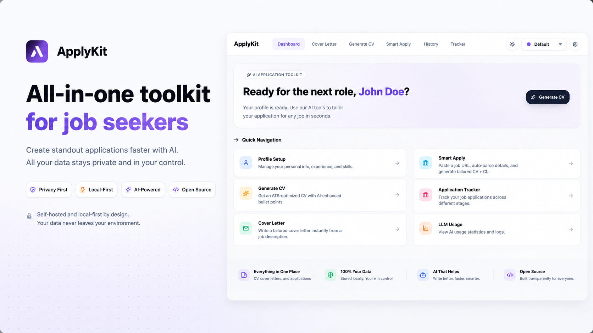

# ApplyKit



[](LICENSE)
[](https://python.org)
[](https://kit.svelte.dev)

**Self-hosted, local-first tools for creating tailored resumes, cover letters, and job applications with AI.**

ApplyKit stores profiles, generated documents, application history, and provider credentials on infrastructure you control. No subscription is required.

> ApplyKit defaults to `DEPLOYMENT_MODE=local`, binds the manual backend to loopback, and rejects non-loopback browser origins. Remote deployments fail startup unless the required authentication, HTTPS, cookie, CORS, and credential-key protections are configured.

## Highlights

- Multiple role-specific profiles
- Resume import from PDF, DOCX, or pasted text
- ATS-focused resume enhancement and PDF export
- Tailored cover letters with streaming output
- Job URL parsing, fit analysis, and Smart Apply
- Kanban application tracker and generation history
- Token, cost, latency, and error usage reporting
- Curated and custom models across hosted and local providers
- Multiple encrypted credentials per provider
- Manual, automatic failover, and round-robin credential routing
- Optional single-owner password protection

## Quick Start

### Docker

```bash
git clone https://github.com/wihlarkop/applykit.git
cd applykit
docker compose up --build
```

Open `http://localhost:3000`. The backend is available at `http://localhost:8000`.

Docker uses two persistent volumes:

- `applykit_applykit-data` for SQLite and application data;
- `applykit_applykit-secrets` for the local credential encryption key.

### Manual development setup

Requirements: [uv](https://docs.astral.sh/uv/) and [Bun](https://bun.sh/).

```bash
git clone https://github.com/wihlarkop/applykit.git
cd applykit
cp backend/.env.example backend/.env
make install
make migrate
```

Start the backend and frontend in separate terminals:

```bash
make backend     # http://localhost:8000
make frontend    # http://localhost:5173
```

The manual backend binds to `127.0.0.1` in local mode.

## Deployment Modes

ApplyKit has an explicit deployment boundary:

```env
DEPLOYMENT_MODE=local   # default; loopback-only browser origins
DEPLOYMENT_MODE=remote  # protected HTTPS deployment
```

Local mode allows:

```env
AUTH_MODE=disabled
COOKIE_SECURE=false
CORS_ORIGINS=["http://localhost:5173"]
```

Local mode rejects LAN addresses, public domains, wildcard origins, credential-bearing URLs, and origins containing paths, queries, or fragments. Switch deliberately to remote mode before exposing ApplyKit beyond loopback.

### Optional protected mode

```env
AUTH_MODE=disabled  # local mode only
AUTH_MODE=password  # single-owner protected mode
```

Protected mode secures the whole installation and every career profile with one owner password. It does not create separate accounts for individual profiles.

When password mode is enabled, the browser redirects an unclaimed installation to `/setup` and an existing protected installation to `/login`.

### First owner setup

Run migrations, start ApplyKit with `AUTH_MODE=password`, then read the backend log:

```bash
# Docker
docker compose logs backend

# Manual
cd backend
uv run alembic upgrade head
uv run main.py
```

Open ApplyKit, paste the one-time token into the setup page, and create the owner password. The token:

- expires after 30 minutes;
- is stored only as a hash;
- is replaced when an unclaimed backend restarts;
- becomes invalid immediately after owner setup.

Owner passwords must contain 12–128 characters. Passphrases are supported without forced uppercase, number, or symbol rules. Passwords are stored as Argon2id PHC hashes.

### Sessions and request protection

- Normal sessions expire 7 days after login.
- **Remember this device** sessions expire after 30 days.
- Expiry is absolute and does not extend with activity.
- The browser warns during the final five minutes and can reauthenticate in a separate tab.
- Session and CSRF token hashes are stored in SQLite; raw session tokens stay in cookies.
- Session cookies are `HttpOnly` and `SameSite=Lax`.
- Mutating requests require a session-bound CSRF token and an allowed `Origin`.
- Five failed attempts within 10 minutes lock authentication for 15 minutes.
- Logout revokes the current session. Password reset revokes every session.

Only health checks and the required setup/login endpoints remain public. Application data, AI settings, credentials, and API documentation require authentication in protected mode.

Password changes and signing out other devices are available under **Settings → Security**. ApplyKit displays only the count of other active sessions and does not collect device, IP, or location details for this view.

### Remote HTTPS deployment

Remote mode is fail-closed. The backend will not start unless all required protections are present:

```env
DEPLOYMENT_MODE=remote
AUTH_MODE=password
COOKIE_SECURE=true
DEBUG=false
CORS_ORIGINS=["https://applykit.example.com"]
CREDENTIAL_ENCRYPTION_KEY_FILE=/run/secrets/applykit_credential_key
```

You may provide `CREDENTIAL_ENCRYPTION_KEY` directly instead of a mounted key file, but configure exactly one source. Prefer a platform-managed secret file where available.

Serve the frontend and API from the same hostname. A reverse proxy can expose the frontend at `/` and forward `/api` to the backend. Build the frontend with the browser-reachable same-origin API path:

```bash
VITE_API_BASE_URL=https://applykit.example.com/api docker compose up --build
```

Remote startup is rejected when:

- authentication is disabled;
- secure cookies are disabled;
- debug mode is enabled;
- a CORS origin uses HTTP or a wildcard;
- an origin contains credentials, paths, queries, or fragments;
- no external credential encryption key is configured;
- two encryption-key sources are configured at the same time.

Do not place the browser UI at `app.example.com` while using a host-only API cookie from `api.example.com`. Do not expose ApplyKit through public plain HTTP.

### Forgotten password

There is no email recovery or recovery key. The login page shows these same recovery commands, which must be run from the machine hosting ApplyKit:

```bash
# Docker
docker compose exec backend uv run python -m app.cli auth reset-password

# Manual
cd backend
uv run python -m app.cli auth reset-password
```

The reset command asks for the new password twice, clears login lockout, and signs out every active session.

### API documentation

```text
DEBUG=false
→ /docs, /redoc, and /openapi.json are disabled

DEBUG=true + DEPLOYMENT_MODE=local + AUTH_MODE=disabled
→ API documentation is public on loopback

DEPLOYMENT_MODE=remote
→ DEBUG=true is rejected at startup
```

## AI Providers and Credentials

Open **AI Settings** from the gear icon to:

- connect and test providers;
- choose a catalog or supported custom model;
- save multiple labeled credentials;
- select an active credential manually;
- enable automatic failover or round robin.

Manual routing is the default. Automatic modes require at least two enabled credentials and allow 2–5 attempts per operation. Streaming requests are never retried after output has started.

Ollama does not require an API key. Some non-AI features remain usable without configuring a provider.

### Provider-key precautions

Use a dedicated API key for ApplyKit rather than reusing an administrator key. Where the provider supports them, apply:

- the minimum required permissions;
- spending and rate limits;
- separate keys for personal and work environments;
- periodic rotation;
- immediate revocation after suspected exposure.

## Credential Security

Provider secrets are encrypted with Fernet before database persistence. The database stores encrypted ciphertext, a masked display value, a keyed duplicate-detection fingerprint, and operational metadata. API responses and the frontend receive masked values only.

Credential input remains in component-local browser state and is not written to `localStorage` or `sessionStorage`. Provider failures return fixed public messages, and credential-bearing exception text is excluded from application logs and usage records.

Local installations create a persistent fallback key at:

```text
backend/.applykit/credential.key
```

Docker stores the active key separately at:

```text
/run/applykit-secrets/credential.key
```

During an upgrade, ApplyKit can migrate the old Docker key from `/data/credential.key`. It copies the key atomically, verifies every encrypted credential, and removes the old key only after successful validation. If validation fails, startup stops and the old key is preserved.

ApplyKit will not create a replacement key when encrypted credentials already exist. A missing, wrong, or corrupted key causes startup to fail rather than silently making stored credentials unreadable.

Generate a Fernet key with:

```bash
python -c "from cryptography.fernet import Fernet; print(Fernet.generate_key().decode())"
```

Never commit an encryption key, bake it into a container image, or print it in CI logs.

## Backup and Restore

Treat the database and encryption key as separate sensitive assets. Both are needed to restore encrypted provider credentials, but they should not be kept in the same unrestricted backup location.

Back up Docker application data:

```bash
mkdir -p backups/data backups/secrets

docker run --rm \
  -v applykit_applykit-data:/source:ro \
  -v "$(pwd)/backups/data":/backup \
  alpine tar czf /backup/applykit-data.tar.gz -C /source .
```

Back up the local Docker encryption key separately:

```bash
docker run --rm \
  -v applykit_applykit-secrets:/source:ro \
  -v "$(pwd)/backups/secrets":/backup \
  alpine tar czf /backup/applykit-secrets.tar.gz -C /source .
```

Store and access-control these archives separately. A database backup alone cannot decrypt provider credentials. A key alone does not contain the credentials. Anyone who obtains both may be able to decrypt them.

Losing the encryption key makes existing encrypted credentials unrecoverable. Revoke and replace the affected keys at each provider.

Do not change or delete the encryption key without a supported credential-rotation procedure. ApplyKit does not yet provide encryption-key rotation or a rotation UI.

## Security Boundaries

Credential encryption materially reduces exposure from a database-only leak, but it cannot protect against every threat. ApplyKit does not claim protection from:

- an administrator or attacker with access to both the database and encryption key;
- malware or a malicious browser extension observing a key while it is entered;
- memory inspection by a privileged attacker during a provider request;
- a compromised AI provider account;
- secrets already copied into historical backups or external logs before an upgrade.

## Configuration

Common local backend variables in `backend/.env`:

```env
DEPLOYMENT_MODE=local
DATABASE_URL=sqlite:///./applykit.db
AUTH_MODE=disabled
COOKIE_SECURE=false
DEBUG=false
CORS_ORIGINS=["http://localhost:5173"]
CREDENTIAL_KEY_FILE=.applykit/credential.key
MAX_PROVIDER_CREDENTIALS=20
```

Managed remote deployments must configure either:

```env
CREDENTIAL_ENCRYPTION_KEY=<persistent-fernet-key>
```

or:

```env
CREDENTIAL_ENCRYPTION_KEY_FILE=/run/secrets/applykit_credential_key
```

For a remote frontend build, use the browser-reachable same-host API URL described under remote HTTPS deployment.

## Stack

- **Frontend:** SvelteKit 2, Svelte 5, TypeScript, Tailwind CSS
- **Backend:** FastAPI, Python 3.12, SQLAlchemy, Alembic
- **Database:** SQLite by default
- **Authentication:** optional Argon2id owner password and opaque database sessions
- **Credential encryption:** Fernet authenticated encryption
- **AI:** LiteLLM
- **PDF:** WeasyPrint
- **Scraping:** direct ATS APIs, Jina Reader, and Crawl4AI fallback

## Useful Commands

```bash
make install
make migrate
make backend
make frontend
make lint

docker compose up --build
docker compose logs -f backend
docker compose exec backend uv run alembic upgrade head
docker compose exec backend uv run python -m app.cli auth reset-password
```

## Supported Job Sources

ApplyKit has direct parsing for Greenhouse, Lever, and Ashby. Other accessible job pages use the generic scraping and LLM extraction flow.

## Contributing

Focused pull requests are welcome. Follow the existing FastAPI and Svelte 5 patterns, add tests for behavior changes, and keep the local-first design intact.

```bash
bun install
bun x lefthook install
```

## License

MIT — see [LICENSE](LICENSE).
